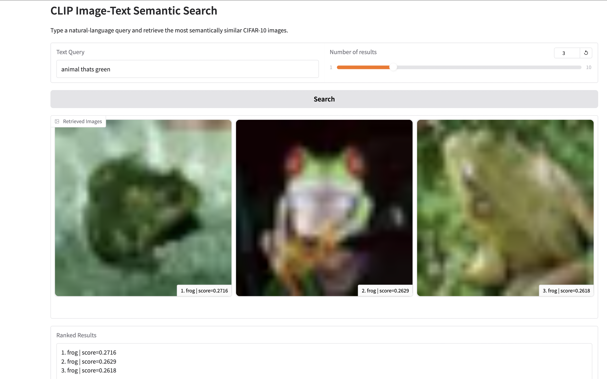
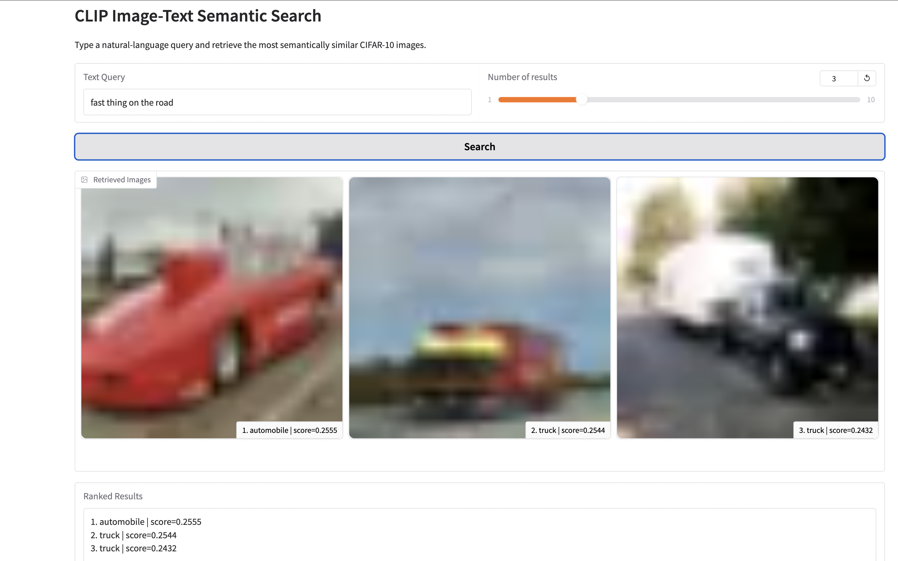
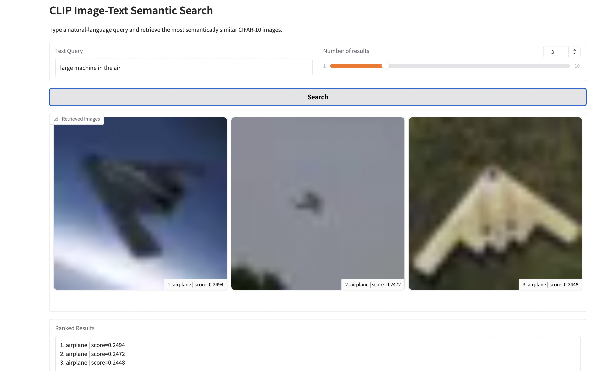

# CLIP Image-Text Semantic Search

A **multimodal semantic retrieval system** that uses OpenAI's CLIP model to map **natural language queries and images into a shared embedding space**.

Users can type descriptions such as *"a green animal"* or *"large machine in the air"*, and the system retrieves the most semantically similar images from the CIFAR-10 dataset.

This project demonstrates how modern multimodal models can perform **text-to-image semantic search using vector embeddings**.

---

# Live Demo

Try the interactive demo here:

https://huggingface.co/spaces/dschechter27/clip-image-text-search

---

# Example Results

Below are example queries and the images retrieved by the CLIP retrieval system.

### Query: "a green animal"



---

### Query: "fast thing on the road"



---

### Query: "large machine in the air"



---
# How It Works

The system uses **CLIP embeddings** to place images and text into the same vector space.

Images are embedded using CLIP's **vision encoder**, while text queries are embedded using the **text encoder**.  
Similarity between the two embeddings is computed using **cosine similarity** to retrieve the most relevant images.

## Retrieval Pipeline

```mermaid
graph TD

A[Text Query] --> B[CLIP Text Encoder]
B --> C[Text Embedding]

D[Images] --> E[CLIP Vision Encoder]
E --> F[Image Embeddings Index]

C --> G[Cosine Similarity Search]
F --> G

G --> H[Top-K Retrieved Images]

---

## Project Structure


clip-image-text-search/

app.py                # Gradio web application
requirements.txt      # project dependencies
README.md

src/                  # ML pipeline scripts
  build_index.py
  search.py
  main.py
  main_v1_demo.py

index/                # precomputed embeddings
  image_embeddings.npy
  labels.npy

screenshots/          # example retrieval outputs
  animal_thats_green.png
  fast_thing_on_the_road.png
  large_machine_in_the_air.png

# Running the Project Locally

Install dependencies:

pip install -r requirements.txt

Run the application:

python app.py

This will launch the **Gradio interface** where you can type natural language queries and retrieve matching images.

---

# Technologies Used

- **CLIP (OpenAI)** – multimodal image-text embeddings  
- **PyTorch** – deep learning framework  
- **HuggingFace Transformers** – model loading  
- **Gradio** – interactive ML demo interface  
- **Cosine Similarity** – vector search for semantic retrieval  

---

# Future Improvements

Potential extensions include:

- Image-to-image similarity search  
- Larger image datasets  
- FAISS indexing for faster retrieval  
- User image upload search  
- Support for additional multimodal datasets  

---

# Author

**David Schechter**

Incoming MIT '30 interested in machine learning, multimodal AI, and intelligent systems.

GitHub: https://github.com/dschechter27  
Hugging Face: https://huggingface.co/dschechter27

---

# License

MIT License
